# Installation & Deployment Guide

Complete setup instructions for AutoMem across all environments.

## Table of Contents

- [Prerequisites](#prerequisites)
- [Quick Start](#quick-start)
- [Deployment](#deployment)
  - [Railway (Recommended)](#railway-recommended)
  - [Docker Compose (Local)](#docker-compose-local)
  - [Bare API (Development)](#bare-api-development)
- [Configuration](#configuration)
- [API Reference](#api-reference)
- [Migration](#migration)
- [Testing](#testing)
- [Troubleshooting](#troubleshooting)

---

## Prerequisites

- **Python 3.10+**
- **Docker & Docker Compose** (for bundled stack)
- **Railway CLI** (for Railway deployment): `npm i -g @railway/cli`

---

## Quick Start

### Local Development (Recommended)

```bash
# Clone repository
git clone https://github.com/verygoodplugins/automem.git
cd automem

# Create virtual environment
python3 -m venv venv
source venv/bin/activate  # On Windows: venv\Scripts\activate

# Install dependencies
pip install -r requirements-dev.txt

# Start all services (FalkorDB + Qdrant + API)
make dev
```

**Services:**

- API: `http://localhost:8001`
- FalkorDB: `localhost:6379`
- Qdrant: `localhost:6333`

**Optional Enhancement:**

Install spaCy for richer entity extraction:

```bash
pip install spacy
python -m spacy download en_core_web_sm
```

---

## Deployment

### Railway (Recommended)

**What is Railway?** Cloud hosting platform (like Heroku, but modern) where your AutoMem service runs 24/7 in containers.

**Cost breakdown:**

- ✅ **$5 free credits** for 30-day trial (no credit card required)
- ✅ **~$0.50/month** typical AutoMem usage after trial
- ✅ **$1/month minimum** if you use less than that

---

#### Should You Deploy to Railway?

**✅ Deploy to Railway if you:**

- **Use multiple devices** - Access same memories from laptop, desktop, mobile
- **Collaborate with a team** - Share memories across team members
- **Want always-on availability** - Don't want to start Docker containers daily
- **Need remote access** - Use AI tools on tablet/phone without local services
- **Value simplicity** - Set it once, forget about it

**🏠 Stick with local if you:**

- **Work on one machine** - Don't need cross-device sync
- **Privacy first** - Keep all memories on your hardware
- **Have Docker skills** - Comfortable managing local services
- **Prefer zero cost** - No cloud bills, just local compute
- **Developing/testing** - Local is faster for iteration

- 

---

#### Option A: One-Click Deploy ⭐ (Fastest)

[](https://railway.com/deploy/automem-ai-memory-service?referralCode=VuFE6g&utm_medium=integration&utm_source=template&utm_campaign=generic)

**What this does:**

- Creates AutoMem API + Remote MCP server + FalkorDB services automatically
- Sets up persistent storage and volumes
- Generates secure API tokens (`AUTOMEM_API_TOKEN`, `ADMIN_API_TOKEN`)
- Configures internal networking (`FALKORDB_HOST`, `FALKORDB_PORT`)
- Generates public domain automatically

**After clicking:**

1. Sign in with GitHub (if not logged in)
2. Review environment variables
3. (Optional) Add `OPENAI_API_KEY` for real embeddings instead of mock embeddings
4. Click **"Deploy"**
5. Wait ~60 seconds for deployment to complete ✅

**Next:** Skip to [Get Your AutoMem URL](#get-your-automem-url) below to get your endpoint.

---

#### Option B: Manual Setup (Advanced)

<details>
<summary><b>Need more control? Click to expand manual deployment steps</b></summary>

#### Step 1: Prerequisites

```bash
# Install Railway CLI
npm i -g @railway/cli

# Log in
railway login

# (Optional) Initialize project
railway init
```

#### Step 2: Provision FalkorDB

1. Create new Railway service:

   - Image: `falkordb/falkordb:latest`
   - Add persistent volume (critical for data persistence)

2. Note the internal connection details (shown in service settings)

3. **Optional**: Set `REDIS_PASSWORD` for authentication

Railway automatically exposes:

- `REDIS_HOST`
- `REDIS_PORT`
- `REDIS_PASSWORD`

Reference these in AutoMem config via `${{service.<name>.internalHost}}`

#### Step 3: Deploy AutoMem

1. Deploy from repo:

   ```bash
   railway up
   ```

   Or connect repo in Railway UI for auto-deploys.

2. Configure environment variables:

   | Variable            | Description                           | Required        |
   | ------------------- | ------------------------------------- | --------------- |
   | `AUTOMEM_API_TOKEN` | Auth token for all client calls       | ✅ Yes          |
   | `ADMIN_API_TOKEN`   | Token for admin/enrichment endpoints  | ✅ Yes          |
   | `FALKORDB_HOST`     | Internal hostname of FalkorDB service | ✅ Yes          |
   | `FALKORDB_PORT`     | FalkorDB port (usually `6379`)        | ✅ Yes          |
   | `OPENAI_API_KEY`    | Enables real embeddings               | Recommended     |
   | `FALKORDB_PASSWORD` | Password if set on FalkorDB           | If enabled      |
   | `QDRANT_URL`        | Qdrant Cloud endpoint                 | Optional        |
   | `QDRANT_API_KEY`    | Qdrant API key                        | If using Qdrant |

3. Verify deployment:

   ```bash
   curl https://your-automem.up.railway.app/health
   ```

   Expected: `{"status": "healthy"}`
   `503` = FalkorDB connection issue (check host/port/password)

#### Get Your AutoMem URL

1. Click on your **automem-api** service (the API, not FalkorDB)
2. Go to **"Settings"** tab
3. Scroll to **"Networking"** → **"Public Networking"**
4. Click **"Generate Domain"** (if not already generated)
5. **Copy the URL** - looks like: `automem-production-abc123.up.railway.app`

**✅ Save this URL!** You'll need it for connecting your AI tools.

</details>

---

#### What You Just Built

```mermaid
flowchart TB
    subgraph devices [Your AI Tools]
        Laptop[💻 Laptop]
        Desktop[🖥️ Desktop]
        Mobile[📱 Mobile]
        Tablet[📱 Tablet]
    end

    subgraph railway [Railway Cloud - Your Free Tier]
        direction TB

        Domain[Public Domain<br/>your-url.up.railway.app<br/>HTTPS Port 443]

        subgraph services [Services]
            API[AutoMem API<br/>Flask Service<br/>Internal Port 8001]
            FalkorDB[(FalkorDB<br/>Graph Database<br/>Port 6379)]
            Volume[Persistent Volume<br/>Data Storage]
        end

        Domain -->|Routes to| API
        API -->|Internal networking| FalkorDB
        FalkorDB -->|Mounts| Volume
    end

    Laptop -->|HTTPS| Domain
    Desktop -->|HTTPS| Domain
    Mobile -->|HTTPS| Domain
    Tablet -->|HTTPS| Domain

    Cloud[☁️ Access from anywhere<br/>Any device, anytime]

    devices -.->|Always available| Cloud
    railway -.->|24/7 uptime| Cloud
```



#### Verify Deployment

Test that everything works:

```bash
# Replace with YOUR Railway URL
curl https://automem-production-abc123.up.railway.app/health
```

**Expected response:**

```json
{ "status": "healthy", "falkordb": "connected" }
```

**Got an error?**

- `503 Service Unavailable` = FalkorDB can't connect. Check:
  - `FALKORDB_HOST` is set to `falkordb.railway.internal` or `${{FalkorDB.RAILWAY_PRIVATE_DOMAIN}}`
  - FalkorDB service is running (green dot in Railway dashboard)
  - Persistent volume is mounted at `/data`
- `401 Unauthorized` = You're trying a protected endpoint. `/health` should work without auth.

#### Next Steps

1. **Store first memory**:

```bash
curl -X POST https://your-automem.railway.app/memory \
  -H "Authorization: Bearer $AUTOMEM_API_TOKEN" \
  -H "Content-Type: application/json" \
  -d '{"content":"First memory from Railway","importance":0.7}'
```

2. **Connect your AI tools** - Use your Railway URL in:

   - [AutoMem MCP Client](https://github.com/verygoodplugins/mcp-automem)
   - Remote MCP for ChatGPT/Claude.ai/ElevenLabs: see docs/MCP_SSE.md
   - Claude Desktop, Cursor, Claude Code, etc.

3. **Set up monitoring** (optional): See [Health Monitoring Guide](docs/HEALTH_MONITORING.md)

👉 **[Full Railway Guide](docs/RAILWAY_DEPLOYMENT.md)** - Advanced configuration, monitoring, troubleshooting
👉 **[Deployment Checklist](docs/DEPLOYMENT_CHECKLIST.md)** - Step-by-step verification

---

### Docker Compose (Local)

Run complete stack locally:

```bash
# Start all services
make dev

# Or manually with docker-compose
docker-compose up -d
```

**docker-compose.yml** includes:

- AutoMem Flask API (port 8001)
- FalkorDB (port 6379)
- Qdrant (port 6333)

Stop services:

```bash
make stop
# Or: docker-compose down
```

---

### Bare API (Development)

Run API without Docker (requires external FalkorDB):

```bash
# Activate virtual environment
source venv/bin/activate

# Set connection details
export FALKORDB_HOST=localhost
export FALKORDB_PORT=6379
export PORT=8001

# Optional: Qdrant configuration
export QDRANT_URL=http://localhost:6333
# export QDRANT_API_KEY=your_key

# Run API
python app.py
```

The API will use deterministic placeholder embeddings if no `OPENAI_API_KEY` or Qdrant is configured.

---

## Configuration

### Environment Variables

AutoMem loads configuration from:

1. Process environment
2. `.env` in project root
3. `~/.config/automem/.env`

#### Core Settings

| Variable            | Description                         | Default     |
| ------------------- | ----------------------------------- | ----------- |
| `PORT`              | API server port                     | `8001`      |
| `FALKORDB_HOST`     | FalkorDB hostname                   | `localhost` |
| `FALKORDB_PORT`     | FalkorDB port                       | `6379`      |
| `FALKORDB_PASSWORD` | FalkorDB password (if auth enabled) | _unset_     |
| `FALKORDB_GRAPH`    | Graph database name                 | `memories`  |

#### Authentication

| Variable            | Description                                     | Default            |
| ------------------- | ----------------------------------------------- | ------------------ |
| `AUTOMEM_API_TOKEN` | Required for all endpoints except `/health`     | _unset_ (required) |
| `ADMIN_API_TOKEN`   | Required for `/admin/*` and enrichment controls | _unset_ (required) |

**Client authentication methods** (in order of preference):

1. `Authorization: Bearer <token>` header
2. `X-API-Key: <token>` header
3. `?api_key=<token>` query parameter

Admin operations additionally require `X-Admin-Token: <admin_token>` header.

#### Vector Search (Optional)

| Variable            | Description                           | Default    |
| ------------------- | ------------------------------------- | ---------- |
| `QDRANT_URL`        | Qdrant API endpoint                   | _unset_    |
| `QDRANT_API_KEY`    | Qdrant authentication                 | _optional_ |
| `QDRANT_COLLECTION` | Qdrant collection name                | `memories` |
| `VECTOR_SIZE`       | Embedding dimension                   | `3072`     |
| `EMBEDDING_MODEL`   | OpenAI embedding model                | `text-embedding-3-large` |
| `OPENAI_API_KEY`    | For real embeddings (vs placeholders) | _unset_    |

👉 **New to Qdrant?** See the [Qdrant Setup Guide](docs/QDRANT_SETUP.md) for step-by-step instructions on creating a collection with the right settings.

> Existing deployments on 768d should set `VECTOR_SIZE=768` (and keep `EMBEDDING_MODEL=text-embedding-3-small`) until after running `scripts/reembed_embeddings.py`. The server now fails fast if your configured dimension does not match the Qdrant collection.

#### Enrichment Pipeline

| Variable                             | Description                        | Default          |
| ------------------------------------ | ---------------------------------- | ---------------- |
| `ENRICHMENT_MAX_ATTEMPTS`            | Retry limit for failed enrichments | `3`              |
| `ENRICHMENT_SIMILARITY_LIMIT`        | Number of semantic neighbors       | `5`              |
| `ENRICHMENT_SIMILARITY_THRESHOLD`    | Min cosine score for `SIMILAR_TO`  | `0.8`            |
| `ENRICHMENT_IDLE_SLEEP_SECONDS`      | Sleep when queue empty             | `2`              |
| `ENRICHMENT_FAILURE_BACKOFF_SECONDS` | Backoff between retries            | `5`              |
| `ENRICHMENT_ENABLE_SUMMARIES`        | Auto-generate summaries            | `true`           |
| `ENRICHMENT_SPACY_MODEL`             | spaCy model for entities           | `en_core_web_sm` |

#### Consolidation Engine

| Variable                                   | Description                             | Default           |
| ------------------------------------------ | --------------------------------------- | ----------------- |
| `CONSOLIDATION_DECAY_INTERVAL_SECONDS`     | Decay cycle frequency                   | `3600` (1 hour)   |
| `CONSOLIDATION_DECAY_IMPORTANCE_THRESHOLD` | Min importance to process (empty = all) | `0.3`             |
| `CONSOLIDATION_CREATIVE_INTERVAL_SECONDS`  | Creative association cycle              | `3600` (1 hour)   |
| `CONSOLIDATION_CLUSTER_INTERVAL_SECONDS`   | Clustering cycle                        | `21600` (6 hours) |
| `CONSOLIDATION_FORGET_INTERVAL_SECONDS`    | Forgetting cycle                        | `86400` (1 day)   |

#### Search Scoring (Advanced)

| Variable                | Description                     | Default             |
| ----------------------- | ------------------------------- | ------------------- |
| `RECALL_RELATION_LIMIT` | Max related memories per result | `5`                 |
| `SEARCH_WEIGHT_*`       | Custom scoring weights          | See app.py defaults |

---

## API Reference

### Authentication

All endpoints except `/health` require authentication via:

- `Authorization: Bearer <AUTOMEM_API_TOKEN>` (recommended)
- `X-API-Key: <AUTOMEM_API_TOKEN>`
- `?api_key=<AUTOMEM_API_TOKEN>`

Admin endpoints additionally require:

- `X-Admin-Token: <ADMIN_API_TOKEN>`

---

### Endpoints

#### `GET /health`

Check service health.

**Response:**

```json
{
  "status": "healthy",
  "falkordb": "connected",
  "qdrant": "connected"
}
```

---

#### `POST /memory`

Store a new memory.

**Request Parameters:**

| Field           | Type   | Required | Description                                                                           |
| --------------- | ------ | -------- | ------------------------------------------------------------------------------------- |
| `content`       | string | ✅ Yes   | Memory content (min 1 char)                                                           |
| `tags`          | array  | No       | Tags for categorization (e.g., `["decision", "database"]`)                            |
| `importance`    | float  | No       | Importance score 0.0-1.0 (default: `0.5`)                                             |
| `type`          | string | No       | Memory classification (default: auto-classified)                                      |
| `confidence`    | float  | No       | Confidence in type 0.0-1.0 (default: `0.9` if type provided, auto-computed otherwise) |
| `metadata`      | object | No       | Custom metadata (any JSON object)                                                     |
| `timestamp`     | string | No       | ISO 8601 timestamp (default: current time)                                            |
| `embedding`     | array  | No       | Vector embedding (auto-generated if omitted; default 3072d or 768d with small model)  |
| `t_valid`       | string | No       | ISO timestamp when memory becomes valid                                               |
| `t_invalid`     | string | No       | ISO timestamp when memory expires                                                     |
| `updated_at`    | string | No       | ISO timestamp of last update (default: `timestamp`)                                   |
| `last_accessed` | string | No       | ISO timestamp of last access (default: `updated_at`)                                  |

**Valid Memory Types:**

- `Decision` - Strategic or technical decisions
- `Pattern` - Recurring approaches or best practices
- `Preference` - User/team preferences
- `Style` - Code style or formatting preferences
- `Habit` - Regular behaviors or workflows
- `Insight` - Key learnings or realizations
- `Context` - General contextual information (default)

**Request Example:**

```json
{
  "content": "Chose PostgreSQL over MongoDB for ACID compliance",
  "type": "Decision",
  "confidence": 0.95,
  "tags": ["database", "architecture"],
  "importance": 0.9,
  "metadata": {
    "source": "architecture-meeting",
    "alternatives": ["MongoDB", "MySQL"],
    "deciding_factors": ["ACID", "team_expertise"]
  },
  "timestamp": "2025-09-16T12:37:21Z"
}
```

**Response:** `201 Created`

```json
{
  "status": "success",
  "memory_id": "uuid-generated-id",
  "stored_at": "2025-09-16T12:37:21Z",
  "type": "Decision",
  "confidence": 0.95,
  "qdrant": "stored",
  "embedding_status": "generated",
  "enrichment": "queued",
  "metadata": {...},
  "timestamp": "2025-09-16T12:37:21Z",
  "updated_at": "2025-09-16T12:37:21Z",
  "last_accessed": "2025-09-16T12:37:21Z"
}
```

**Notes:**

- **Explicit `type` preferred**: Send `type` when you know the classification for immediate, accurate categorization
- **Auto-classification fallback**: Omit `type` to let enrichment pipeline classify based on content
- **Embedding auto-generation**: Service generates real embeddings (OpenAI) or placeholder vectors if omitted
- **Timestamp defaults**: All time fields default to current UTC time if not provided
- **Background enrichment**: Entity extraction and relationship building queued automatically
- **Type validation**: Invalid types return `400 Bad Request` with list of valid options
- **IDs are server-generated**: Clients cannot set `id`; AutoMem always assigns a UUID to prevent collisions/overwrites.

---

#### `GET /recall`

Retrieve memories using hybrid search.

**Query Parameters:**

| Parameter      | Description                                       | Example                             |
| -------------- | ------------------------------------------------- | ----------------------------------- |
| `query`        | Full-text search string                           | `database migration`                |
| `embedding`    | 768-d vector (comma-separated)                    | `0.12,0.56,...`                     |
| `limit`        | Max results (1-50)                                | `10`                                |
| `time_query`   | Natural time phrases                              | `today`, `last week`, `last 7 days` |
| `start`        | ISO timestamp (lower bound)                       | `2025-09-01T00:00:00Z`              |
| `end`          | ISO timestamp (upper bound)                       | `2025-09-30T23:59:59Z`              |
| `tags`         | Tag filters (multiple allowed)                    | `slack`, `decision`                 |
| `tag_mode`     | `any` or `all`                                    | `any` (default)                     |
| `tag_match`    | `prefix` or `exact`                               | `prefix` (default)                  |
| `context`      | High-level context label                          | `coding-style`, `preference`        |
| `language`     | Explicit language hint                            | `python`, `typescript`              |
| `active_path`  | Active file path (used to infer language/context) | `/Users/jack/project/app.py`        |
| `context_tags` | Comma or list of tags to prioritize               | `coding-style,python`               |
| `context_types`| Memory types to prioritize                        | `Style,Preference`                  |
| `priority_ids` | Specific memory IDs to treat as anchors           | `uuid-1,uuid-2`                     |

**Examples:**

```bash
# Hybrid query with tags
GET /recall?query=handoff&tags=slack&tag_mode=any

# Semantic search only
GET /recall?embedding=0.12,0.56,...&limit=10

# Time-based recall
GET /recall?query=database&time_query=last%20month

# Tag prefix matching (matches slack:*, slack:U123:*, etc.)
GET /recall?tags=slack&tag_match=prefix

# Require all tags
GET /recall?tags=deployment&tags=success&tag_mode=all
```

**Response:**

```json
{
  "status": "success",
  "results": [
    {
      "id": "memory-uuid",
      "match_type": "vector",
      "final_score": 0.82,
      "score_components": {
        "vector": 0.64,
        "tag": 0.5,
        "recency": 0.9,
        "exact": 1.0
      },
      "memory": {
        "content": "...",
        "tags": ["deployment"],
        "importance": 0.9,
        "timestamp": "2025-09-16T12:37:21Z"
      }
    }
  ],
  "time_window": {
    "start": "2025-09-01T00:00:00+00:00",
    "end": "2025-09-30T23:59:59+00:00"
  },
  "tags": ["slack"],
  "count": 5,
  "context_priority": {
    "language": "python",
    "context": "coding-style",
    "priority_tags": ["coding-style","python"],
    "priority_types": ["Style","Preference"],
    "injected": false
  }
}
```

When no context hints are provided, recall behaves exactly as before (hybrid vector/keyword/tags/time). Context hints simply boost and, if needed, inject style/preference memories relevant to the active file; see `docs/API.md` for full details.

---

#### `PATCH /memory/<id>`

Update an existing memory.

**Request:** (all fields optional)

```json
{
  "content": "Updated content",
  "tags": ["new-tag"],
  "importance": 0.95,
  "metadata": { "updated": true }
}
```

**Notes:**

- Changing content triggers automatic re-embedding
- Partial updates supported (only send fields to change)

---

#### `DELETE /memory/<id>`

Delete a memory from both FalkorDB and Qdrant.

**Response:**

```json
{
  "status": "success",
  "message": "Memory deleted successfully"
}
```

---

#### `GET /memory/by-tag`

Filter memories by tags.

**Query Parameters:**

- `tags` - One or more tags (multiple `tags` params or comma-separated)
- `limit` - Max results (default 50)

**Example:**

```bash
GET /memory/by-tag?tags=deployment&tags=success&limit=20
```

Returns most recent/important memories matching any requested tag.

---

#### `POST /associate`

Create a relationship between two memories.

**Request:**

```json
{
  "memory1_id": "uuid-source",
  "memory2_id": "uuid-target",
  "type": "RELATES_TO",
  "strength": 0.8
}
```

**Relationship Types:**

- `RELATES_TO` - General connection
- `LEADS_TO` - Causal (bug→solution)
- `OCCURRED_BEFORE` - Temporal sequence
- `PREFERS_OVER` - User/team preferences
- `EXEMPLIFIES` - Pattern examples
- `CONTRADICTS` - Conflicting approaches
- `REINFORCES` - Supporting evidence
- `INVALIDATED_BY` - Outdated information
- `EVOLVED_INTO` - Knowledge evolution
- `DERIVED_FROM` - Source relationships
- `PART_OF` - Hierarchical structure

**Response:**

```json
{
  "status": "success",
  "message": "Association created successfully"
}
```

---

#### `GET /enrichment/status`

Check enrichment pipeline health.

**Response:**

```json
{
  "status": "healthy",
  "pending": 5,
  "in_flight": 2,
  "last_success": "2025-10-01T12:34:56Z",
  "last_error": null,
  "workers": 1
}
```

---

#### `POST /enrichment/reprocess`

Re-queue memories for enrichment (requires admin token).

**Request:**

```json
{
  "ids": ["memory-id-1", "memory-id-2"],
  "force": true
}
```

**Headers Required:**

- `Authorization: Bearer <AUTOMEM_API_TOKEN>`
- `X-Admin-Token: <ADMIN_API_TOKEN>`

---

#### `POST /admin/reembed`

Regenerate embeddings in batches (requires admin token).

**Request:**

```json
{
  "batch_size": 32,
  "limit": 100
}
```

**Example:**

```bash
curl -X POST https://your-automem.railway.app/admin/reembed \
  -H "Authorization: Bearer $AUTOMEM_API_TOKEN" \
  -H "X-Admin-Token: $ADMIN_API_TOKEN" \
  -d '{"batch_size": 32, "limit": 100}'
```

Perfect for migrations or after updating embedding model.

---

## Migration

### From MCP SQLite Memory Service

Use the migration helper to transfer memories from legacy MCP SQLite:

```bash
# Preview migration (dry-run)
python scripts/migrate_mcp_sqlite.py --dry-run

# Run migration with custom settings
python scripts/migrate_mcp_sqlite.py \
  --db /path/to/sqlite_vec.db \
  --automem-url https://your-automem.railway.app \
  --api-token "$AUTOMEM_API_TOKEN" \
  --limit 1000 \
  --sleep 0.1
```

**Options:**

- `--db` - SQLite database path (auto-detected on macOS/Linux/Windows if omitted)
- `--automem-url` - AutoMem endpoint (default: `http://localhost:8001`)
- `--api-token` - API token (uses `AUTOMEM_API_TOKEN` env var if not specified)
- `--limit` - Max memories to migrate
- `--offset` - Skip first N memories
- `--sleep` - Delay between batches (seconds)
- `--dry-run` - Preview payloads without sending

**What Gets Migrated:**

- ✅ Content, tags, importance, metadata
- ✅ Timestamps preserved
- ✅ Legacy metadata stored under `metadata.legacy`
- ✅ Batch processing with progress tracking

Start with `--dry-run` to inspect, then rerun without it to execute.

---

## Testing

AutoMem includes comprehensive test coverage across three modes:

### Unit Tests (Default)

```bash
make test
```

- No external services required
- Uses in-memory stubs
- Fast execution
- Filtered warnings (see `pytest.ini`)

### Integration Tests (Local Docker)

```bash
make test-integration
```

- Automatically starts Docker services
- Runs full integration suite
- Creates/updates/deletes with unique UUIDs
- Cleans up after itself
- Requires Docker and Railway CLI

### Live Server Tests (Railway)

```bash
make test-live
```

- Tests against live Railway deployment
- Requires Railway CLI and project linkage
- Interactive confirmation before running
- Use `./test-live-server-auto.sh` for CI

**Manual Integration Testing:**

```bash
# Custom endpoint
AUTOMEM_RUN_INTEGRATION_TESTS=1 \
  AUTOMEM_TEST_BASE_URL=https://your-automem.railway.app \
  AUTOMEM_ALLOW_LIVE=1 \
  AUTOMEM_TEST_API_TOKEN=$AUTOMEM_API_TOKEN \
  AUTOMEM_TEST_ADMIN_TOKEN=$ADMIN_API_TOKEN \
  make test

# Local with auto Docker management
AUTOMEM_RUN_INTEGRATION_TESTS=1 \
  AUTOMEM_START_DOCKER=1 \
  AUTOMEM_STOP_DOCKER=1 \
  make test
```

**Environment Variables:**

- `AUTOMEM_TEST_BASE_URL` - Override default `http://localhost:8001`
- `AUTOMEM_ALLOW_LIVE=1` - Required for non-localhost endpoints
- `AUTOMEM_TEST_API_TOKEN` / `AUTOMEM_TEST_ADMIN_TOKEN` - Auth tokens

See **[TESTING.md](TESTING.md)** for complete testing documentation.

---

## Troubleshooting

### Common Issues

#### `401 Unauthorized`

- **Cause:** Missing or incorrect API token
- **Fix:** Ensure `AUTOMEM_API_TOKEN` matches client's header/query param
- **Check:** Look for `Authorization: Bearer <token>` in request

#### `503 Service Unavailable` / `FalkorDB is unavailable`

- **Cause:** Cannot connect to FalkorDB
- **Fix:** Verify `FALKORDB_HOST` and `FALKORDB_PORT` are correct
- **Check:** Test connection: `redis-cli -h $FALKORDB_HOST -p $FALKORDB_PORT ping`
- **Railway:** Ensure FalkorDB service is running and internal hostname is correct

#### `Embedding must contain exactly 768 values`

- **Cause:** Incorrect embedding dimension
- **Fix:** Supply full 768-d vector or omit field entirely
- **Note:** Service generates placeholder if embedding omitted

#### Qdrant Errors (Logged but Non-Blocking)

- **Behavior:** API continues working; vector search disabled
- **Fix:** Check `QDRANT_URL` and `QDRANT_API_KEY` configuration
- **Logs:** Inspect application logs for specific Qdrant error messages
- **Fallback:** FalkorDB operations continue normally

#### Enrichment Not Processing

- **Check:** `GET /enrichment/status` for queue health
- **Causes:**
  - Worker thread crashed (check logs)
  - spaCy model not installed (`pip install spacy`)
  - Memory already enriched (check `metadata.enriched_at`)
- **Fix:** Force reprocess: `POST /enrichment/reprocess` with memory IDs

#### Consolidation Not Running

- **Check:** Application logs for scheduler errors
- **Verify:** Interval environment variables are valid integers
- **Test:** Manually trigger (requires code modification for testing)

### Debug Mode

Enable detailed logging:

```bash
# Development
export FLASK_ENV=development
export LOG_LEVEL=DEBUG
python app.py

# Production (Railway)
# Set LOG_LEVEL=DEBUG in environment variables
```

### Health Checks

```bash
# Basic health
curl https://your-automem.railway.app/health

# Enrichment status
curl https://your-automem.railway.app/enrichment/status \
  -H "Authorization: Bearer $AUTOMEM_API_TOKEN"

# Test memory storage
curl -X POST https://your-automem.railway.app/memory \
  -H "Authorization: Bearer $AUTOMEM_API_TOKEN" \
  -H "Content-Type: application/json" \
  -d '{"content":"Test memory","importance":0.5}'
```

---

## Support

- **Documentation:** [automem.ai](https://automem.ai)
- **Issues:** [GitHub Issues](https://github.com/verygoodplugins/automem/issues)
- **MCP Integration:** [@verygoodplugins/mcp-automem](https://www.npmjs.com/package/@verygoodplugins/mcp-automem)

---

## License

MIT License - See [LICENSE](LICENSE) file for details.
