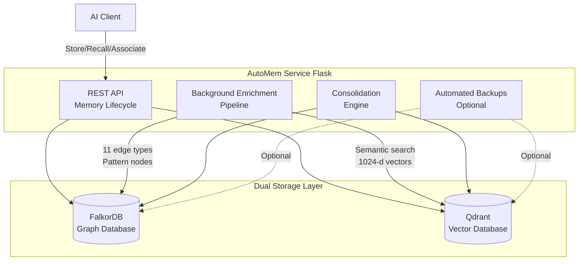

<p align="center">
  
</p>

<p align="center">
  <a href="https://www.npmjs.com/package/@verygoodplugins/mcp-automem"></a>
  <a href="LICENSE"></a>
  <a href="https://automem.ai/discord"></a>
  <a href="https://x.com/automem_ai"></a>
  <a href="benchmarks/EXPERIMENT_LOG.md"></a>
  <a href="https://railway.com/deploy/automem-ai-memory-service?referralCode=VuFE6g&utm_medium=integration&utm_source=github&utm_campaign=generic"></a>
</p>

<p align="center">
  <strong>Long-term memory for AI assistants. Graph + vector. Runs on your hardware.</strong>
</p>

<!-- VIDEO PLACEHOLDER — replace this comment with a centered <p> containing a thumbnail image linking to the vidrush demo URL once recorded. Suggested markup:
<p align="center">
  <a href="https://vidrush.app/v/REPLACE-ME"></a>
</p>
-->

# AutoMem

Your AI forgets between sessions. RAG dumps documents that look similar. Vector databases match keywords but miss meaning. None of them learn.

AutoMem stores typed relationships *and* embeddings. When you ask "why did we choose PostgreSQL?", recall returns not just the matching memory — but the alternatives you considered, the principle behind the choice, and the related decisions that came after.

It scores **89.27%** on the LoCoMo long-term memory benchmark (ACL 2024) judge-off, and **87.56%** judge-on. See [`benchmarks/EXPERIMENT_LOG.md`](benchmarks/EXPERIMENT_LOG.md) for methodology and history.

Additional LongMemEval and BEAM validation is tracked in [`benchmarks/EXPERIMENT_LOG.md`](benchmarks/EXPERIMENT_LOG.md); BEAM is currently reported as exploratory because published comparisons are not yet apples-to-apples.

## Should you use AutoMem?

| Use AutoMem if... | Look elsewhere if... |
|---|---|
| You want one memory across Claude / Cursor / ChatGPT / Codex | You need SOC2 / HIPAA audit logs and row-level ACLs |
| You're comfortable self-hosting (Docker or Railway) | You want a managed SaaS with a polished dashboard |
| You're a solo dev, prosumer, or small team | You're running a multi-agent swarm needing per-agent memory isolation |
| You want to own your memory data | You need an enterprise SLA and dedicated support |

If your row is on the right, AutoMem isn't it — yet. Try [Mem0](https://mem0.ai), [Letta](https://letta.com), or [Zep](https://www.getzep.com) instead.

## How it works

AutoMem combines two storage layers behind a single API:

- **[FalkorDB](https://www.falkordb.com/)** stores memories as nodes with **11 typed relationships** between them. The graph is the canonical record.
- **[Qdrant](https://qdrant.tech/)** stores an embedding for every memory. Recall is a hybrid query — semantic similarity, graph traversal, temporal alignment, tag overlap, and importance — ranked by a 9-component score.


```mermaid
flowchart TB
    subgraph service [AutoMem Service Flask]
        API[REST API<br/>Memory Lifecycle]
        Enrichment[Background Enrichment<br/>Pipeline]
        Consolidation[Consolidation<br/>Engine]
        Backups[Automated Backups<br/>Optional]
    end

    subgraph storage [Dual Storage Layer]
        FalkorDB[(FalkorDB<br/>Graph Database)]
        Qdrant[(Qdrant<br/>Vector Database)]
    end

    Client[AI Client] -->|Store/Recall/Associate| API
    API --> FalkorDB
    API --> Qdrant
    Enrichment -->|11 edge types<br/>Pattern nodes| FalkorDB
    Enrichment -->|Semantic search<br/>1024-d vectors| Qdrant
    Consolidation --> FalkorDB
    Consolidation --> Qdrant
    Backups -.->|Optional| FalkorDB
    Backups -.->|Optional| Qdrant
```

If Qdrant is unavailable, the graph still serves recall in a degraded mode. If FalkorDB is down, the API returns 503 — the graph is the source of truth.

### Multi-hop bridge discovery

Ask "why boring tech for Kafka?" and AutoMem doesn't just match the word "Kafka". It traverses the graph from the seed memories to find the bridge that connects them:

- **Seed 1**: "Migrated to PostgreSQL for operational simplicity"
- **Seed 2**: "Evaluating Kafka vs RabbitMQ for message queue"
- **Bridge**: "Team prefers boring technology — proven, debuggable systems"

Both seeds carry an `EXEMPLIFIES` edge to the bridge memory. AutoMem ranks the bridge above the seeds and surfaces it in the recall response, so the assistant answers with your reasoning, not isolated facts. Tune via `expand_relations`, `relation_limit`, and `expansion_limit` on `GET /recall`.

### 11 authorable relationship types

| Type | Use case | Example |
|---|---|---|
| `RELATES_TO` | General connection | Bug report → Related issue |
| `LEADS_TO` | Causal relationship | Problem → Solution |
| `OCCURRED_BEFORE` | Temporal sequence | Planning → Execution |
| `PREFERS_OVER` | User preferences | PostgreSQL → MongoDB |
| `EXEMPLIFIES` | Pattern examples | Code review → Best practice |
| `CONTRADICTS` | Conflicting info | Old approach → New approach |
| `REINFORCES` | Supporting evidence | Decision → Validation |
| `INVALIDATED_BY` | Outdated info | Legacy docs → Current docs |
| `EVOLVED_INTO` | Knowledge evolution | Initial design → Final design |
| `DERIVED_FROM` | Source tracking | Implementation → Spec |
| `PART_OF` | Hierarchical structure | Feature → Epic |

Three more edge types are added automatically by the [enrichment pipeline](docs/API.md) and consolidation engine: `SIMILAR_TO`, `PRECEDED_BY`, and `DISCOVERED`.

### Memory consolidation, neuroscience-inspired

AutoMem implements [biological memory consolidation cycles](https://pmc.ncbi.nlm.nih.gov/articles/PMC4648295/). Wrong rabbit holes fade naturally. Important memories with strong connections strengthen over time.

| Cycle | Frequency | Purpose |
|---|---|---|
| **Decay** | Daily | Exponential relevance scoring (age, access, connections, importance) |
| **Creative** | Weekly | REM-like processing that discovers non-obvious connections |
| **Cluster** | Monthly | Groups similar memories, generates meta-patterns |
| **Forget** | Off by default | Archives low-relevance memories (<0.2), deletes very old (<0.05) |

Tune intervals via `CONSOLIDATION_*_INTERVAL_SECONDS`. See [`docs/ENVIRONMENT_VARIABLES.md`](docs/ENVIRONMENT_VARIABLES.md).

For more on the recall scoring formula, enrichment internals, and how AutoMem differs from RAG and pure vector databases, see [`docs/COMPARISON.md`](docs/COMPARISON.md).

## Research foundation

AutoMem implements techniques from peer-reviewed memory research:

- **[HippoRAG 2](https://arxiv.org/abs/2502.14802)** (Ohio State, 2025) — graph + vector hybrid for associative memory
- **[A-MEM](https://arxiv.org/abs/2502.12110)** (2025) — Zettelkasten-inspired dynamic memory organization
- **[MELODI](https://arxiv.org/html/2410.03156v1)** (DeepMind, 2024) — gist-based memory compression
- **[ReadAgent](https://arxiv.org/abs/2402.09727)** (DeepMind, 2024) — episodic memory for context extension

Full writeups, findings, and how AutoMem implements each → [`docs/RESEARCH.md`](docs/RESEARCH.md).

## Run it

### Railway (60 seconds)

[](https://railway.com/deploy/automem-ai-memory-service?referralCode=VuFE6g&utm_medium=integration&utm_source=github&utm_campaign=generic)

Deploys four services from pre-built Docker images: `automem` (the API), `falkordb` (graph), `qdrant` (vectors), and `mcp-automem` (the MCP bridge for ChatGPT, Claude.ai, and ElevenLabs). Auto-redeploys nightly on `:stable`. Roughly **$0.50/month** after the $5 free trial.

→ Full setup: [INSTALLATION.md](INSTALLATION.md#deployment)

### Docker Compose (local)

```bash
git clone https://github.com/verygoodplugins/automem.git
cd automem
make dev
```

| Service | URL | Purpose |
|---|---|---|
| AutoMem API | `http://localhost:8001` | Memory REST API |
| FalkorDB | `localhost:6379` | Graph database |
| Qdrant | `localhost:6333` | Vector database |
| FalkorDB Browser | `http://localhost:3000` | Local graph inspection UI |

→ Full setup: [INSTALLATION.md](INSTALLATION.md#docker-compose-local)

### Python (development)

```bash
make install
source .venv/bin/activate
PORT=8001 python app.py
```

Requires Python 3.10+ (3.12 recommended). → [INSTALLATION.md](INSTALLATION.md#bare-api-development)

## Connect your AI

| Client | Mode | Setup |
|---|---|---|
| Claude Desktop, Cursor, Claude Code, Codex, Copilot, Antigravity | Local MCP bridge | `npx @verygoodplugins/mcp-automem setup` |
| ChatGPT (developer mode), Claude.ai web/mobile, ElevenLabs Agents | Remote MCP (HTTPS) | [`docs/MCP_SSE.md`](docs/MCP_SSE.md) |
| Anything else | Direct REST API | [`docs/API.md`](docs/API.md) |

The MCP bridge is published as [`@verygoodplugins/mcp-automem`](https://www.npmjs.com/package/@verygoodplugins/mcp-automem). It handles client-specific config (rules files, hooks, templates) and proxies to your AutoMem service — local or Railway.

Direct API call:

```python
import requests

token = "your-automem-api-token"

requests.post(
    "https://your-automem.railway.app/memory",
    headers={"Authorization": f"Bearer {token}"},
    json={
        "content": "Chose PostgreSQL over MongoDB for ACID compliance",
        "type": "Decision",
        "tags": ["database", "architecture"],
        "importance": 0.9,
    },
)
```

## Screenshots

<!-- CAPTURE CHECKLIST — replace each placeholder image once captured:
1. docs/img/graph-recall.png — FalkorDB browser at http://localhost:3000 showing a memory node with multiple typed edges visible (PREFERS_OVER, EXEMPLIFIES, RELATES_TO). Proves the graph is real.
2. docs/img/claude-recall.png — Claude Desktop conversation where the assistant cites a recalled memory inline, with the AutoMem MCP tool call visible in the trace.
3. docs/img/railway-services.png — Railway dashboard showing the four deployed services (automem, mcp-automem, qdrant, falkordb). A version exists as a GitHub user-attachment in INSTALLATION.md; capture a clean version and host it in-repo.

Until each PNG exists, the table cells will render as broken-image icons on GitHub. -->

_Screenshots will be added once the referenced in-repo image assets are available._

## Docs, community, and license

**Setup**
- [Installation guide](INSTALLATION.md) — Railway, Docker, development
- [Qdrant setup](docs/QDRANT_SETUP.md) — vector database configuration
- [Environment variables](docs/ENVIRONMENT_VARIABLES.md) — full reference

**API and integration**
- [API reference](docs/API.md) — endpoints, scoring, enrichment
- [Remote MCP](docs/MCP_SSE.md) — ChatGPT, Claude.ai, ElevenLabs
- [Migrations](docs/MIGRATIONS.md) — moving from MCP SQLite

**Research and comparison**
- [Research foundation](docs/RESEARCH.md) — papers and how AutoMem implements them
- [Comparison](docs/COMPARISON.md) — vs. RAG, vector DBs, building your own
- [Benchmark history](benchmarks/EXPERIMENT_LOG.md) — LoCoMo, LongMemEval, and BEAM methodology and runs

**Operations**
- [Health monitoring & backups](docs/MONITORING_AND_BACKUPS.md)
- [Testing guide](docs/TESTING.md) — unit, integration, benchmarks

**Community**
- [automem.ai](https://automem.ai) — official site
- [Discord](https://automem.ai/discord) — community chat
- [X / @automem_ai](https://x.com/automem_ai) — updates
- [YouTube / @AutoJackBot](https://www.youtube.com/@AutoJackBot) — tutorials
- [GitHub issues](https://github.com/verygoodplugins/automem/issues) — bugs and feature requests

**Sibling repos**
- [`mcp-automem`](https://github.com/verygoodplugins/mcp-automem) — universal MCP bridge / install funnel
- [`automem-evals`](https://github.com/verygoodplugins/automem-evals) — exploratory recall-quality lab
- [`automem-graph-viewer`](https://github.com/verygoodplugins/automem-graph-viewer) — standalone graph visualization

MIT licensed. Deploy anywhere. No vendor lock-in.
