<p align="center">
  
</p>

<p align="center">
  <strong>$AUTOMEM</strong>:
  <a href="https://bags.fm/CV485ySXfgFiwLtbh815JRukH4r9ChLhddqsAaZKBAGS">Bags.fm</a> •
  <a href="https://jup.ag/tokens/CV485ySXfgFiwLtbh815JRukH4r9ChLhddqsAaZKBAGS">Jupiter</a> •
  <a href="https://photon-sol.tinyastro.io/en/lp/CV485ySXfgFiwLtbh815JRukH4r9ChLhddqsAaZKBAGS">Photon</a> •
  <a href="https://dexscreener.com/solana/CV485ySXfgFiwLtbh815JRukH4r9ChLhddqsAaZKBAGS">DEXScreener</a>
</p>

<p align="center"><code>CA: CV485ySXfgFiwLtbh815JRukH4r9ChLhddqsAaZKBAGS</code> (Solana)</p>

# **AI Memory That Actually Learns**

AutoMem is a **production-grade long-term memory system** for AI assistants, achieving **90.53% accuracy** on the [LoCoMo benchmark](docs/TESTING.md#locomo-benchmark) (ACL 2024)—outperforming CORE (88.24%).

**Deploy in 60 seconds:**

```bash
railway up
```

---

## Why AutoMem Exists

Your AI forgets everything between sessions. RAG dumps similar documents. Vector databases match keywords but miss meaning. **None of them learn.**

AutoMem gives AI assistants the ability to **remember, connect, and evolve** their understanding over time—just like human long-term memory.

## How AutoMem Works

AutoMem combines two complementary storage systems:

- **FalkorDB (Graph)** - Stores memories as nodes with typed relationships between them
- **Qdrant (Vectors)** - Enables semantic similarity search via embeddings

This dual architecture lets you ask questions like "why did we choose PostgreSQL?" and get not just the memory, but the reasoning, preferences, and related decisions that informed it.

### Core Capabilities

- 🧠 **Store** memories with metadata, importance scores, and temporal context
- 🔍 **Recall** via hybrid search combining semantic, keyword, graph, and temporal signals
- 🔗 **Connect** memories with 11 typed relationships (RELATES_TO, LEADS_TO, CONTRADICTS, etc.)
- 🎯 **Learn** through automatic entity extraction, pattern detection, and consolidation
- ⚡ **Perform** with sub-100ms recall across thousands of memories

### Research Foundation

AutoMem implements techniques from peer-reviewed memory research:

- **HippoRAG 2** (Ohio State, 2025): Graph-vector hybrid for associative memory
- **A-MEM** (2025): Dynamic memory organization with Zettelkasten-inspired clustering
- **MELODI** (DeepMind, 2024): Compression via gist representations
- **ReadAgent** (DeepMind, 2024): Context extension through episodic memory

## Architecture


**FalkorDB** (graph) = canonical record, relationships, consolidation
**Qdrant** (vectors) = semantic recall, similarity search
**Dual storage** = Built-in redundancy and disaster recovery

## Why Graph + Vector?

```mermaid
flowchart LR
    subgraph trad [Traditional RAG Vector Only]
        direction TB
        Query1[Query: What database?]
        VectorDB1[(Vector DB)]
        Result1[✅ PostgreSQL memory<br/>❌ No reasoning<br/>❌ No connections]

        Query1 -->|Similarity search| VectorDB1
        VectorDB1 --> Result1
    end

    subgraph automem [AutoMem Graph + Vector]
        direction TB
        Query2[Query: What database?]

        subgraph hybrid [Hybrid Search]
            VectorDB2[(Qdrant<br/>Vectors)]
            GraphDB2[(FalkorDB<br/>Graph)]
        end

        Result2[✅ PostgreSQL memory<br/>✅ PREFERS_OVER MongoDB<br/>✅ RELATES_TO team expertise<br/>✅ DERIVED_FROM boring tech]

        Query2 --> VectorDB2
        Query2 --> GraphDB2
        VectorDB2 --> Result2
        GraphDB2 --> Result2
    end
```



### Traditional RAG (Vector Only)

```text
Memory: "Chose PostgreSQL for reliability"
Query: "What database should I use?"
Result: ✅ Finds the memory
         ❌ Doesn't know WHY you chose it
         ❌ Can't connect to related decisions
```

### AutoMem (Graph + Vector)

```text
Memory: "Chose PostgreSQL for reliability"
Graph: PREFERS_OVER MongoDB
       RELATES_TO "team expertise" memory
       DERIVED_FROM "boring technology" principle

Query: "What database should I use?"
Result: ✅ Finds the memory
        ✅ Knows your decision factors
        ✅ Shows related preferences
        ✅ Explains your reasoning pattern
```

## How It Works in Practice

### Multi-Hop Bridge Discovery

When you ask a question, AutoMem doesn't just find relevant memories—it finds the **connections between them**. This is called bridge discovery: following graph relationships to surface memories that link your initial results together.


**Traditional RAG:** Returns "Kafka" memories (misses the connection)

**AutoMem bridge discovery:**

- Seed 1: "Migrated to PostgreSQL for operational simplicity"
- Seed 2: "Evaluating Kafka vs RabbitMQ for message queue"
- Bridge: "Team prefers boring technology—proven, debuggable systems"

AutoMem finds the bridge that connects both decisions → Result: AI understands your architectural philosophy, not just isolated choices

**How to enable:**

- Set `expand_relations=true` in recall requests (enabled by default)
- Control depth with `relation_limit` and `expansion_limit` parameters
- Results are ranked by relation strength, temporal relevance, and importance

### Knowledge Graphs That Evolve

```text
# After storing: "Migrated to PostgreSQL for operational simplicity"

AutoMem automatically:
├── Extracts entities (PostgreSQL, operational simplicity)
├── Auto-tags (entity:tool:postgresql, entity:concept:ops-simplicity)
├── Detects pattern ("prefers boring technology")
├── Links temporally (PRECEDED_BY migration planning)
└── Connects semantically (SIMILAR_TO "Redis deployment")

# Next query: "Should we use Kafka?"
AI recalls:
- PostgreSQL decision
- "Boring tech" pattern (reinforced across memories)
- Operational simplicity preference
→ Suggests: "Based on your pattern, consider RabbitMQ instead"
```

### 9-Component Hybrid Scoring


```bash
GET /recall?query=database%20migration&tags=decision&time_query=last%20month

# AutoMem combines nine signals:
score = vector×0.25       # Semantic similarity
      + keyword×0.15      # TF-IDF text matching
      + relation×0.25     # Graph relationship strength
      + content×0.25      # Direct token overlap
      + temporal×0.15     # Time alignment with query
      + tag×0.10          # Tag matching
      + importance×0.05   # User-assigned priority
      + confidence×0.05   # Memory confidence
      + recency×0.10      # Freshness boost

# Result: Memories ranked by meaning, not just similarity
```

## Features

### Core Memory Operations

- **Store** - Rich memories with metadata, importance, timestamps, embeddings
- **Recall** - Hybrid search (vector + keyword + tags + time windows)
- **Update** - Modify memories, auto-regenerate embeddings
- **Delete** - Remove from both graph and vector stores
- **Associate** - Create typed relationships between memories
- **Filter** - Tag-based queries with prefix/exact matching

## Memory Consolidation

AutoMem uses [neuroscience-inspired](https://pmc.ncbi.nlm.nih.gov/articles/PMC4648295/) consolidation cycles—like human sleep—to keep memories relevant:

| Cycle        | Frequency | Purpose                                                              |
| ------------ | --------- | -------------------------------------------------------------------- |
| **Decay**    | Daily     | Exponential relevance scoring (age, access, connections, importance) |
| **Creative** | Weekly    | REM-like processing that discovers non-obvious connections           |
| **Cluster**  | Monthly   | Groups similar memories, generates meta-patterns                     |
| **Forget**   | Disabled  | Archives low-relevance (<0.2), deletes very old (<0.05) when enabled |

**How it works:**

- Wrong rabbit holes fade naturally (~30-45 days without access)
- Important memories with strong connections stay indefinitely
- Memories archive before deletion (0.05-0.2 relevance range)
- The system learns what matters to you, not what you explicitly tag

### Background Intelligence

Every memory gets automatically enhanced in the background (doesn't block your API calls):

**Enrichment Pipeline** (runs immediately after storage):

- **Entity extraction** - Identifies people, projects, tools, concepts (spaCy NLP)
- **Auto-tagging** - Generates `entity:<type>:<slug>` for structured queries
- **Summaries** - Lightweight gist representations for quick scanning
- **Temporal links** - Connects to recent memories with `PRECEDED_BY` relationships
- **Semantic neighbors** - Finds similar memories via cosine similarity (`SIMILAR_TO`)
- **Pattern detection** - Reinforces emerging themes across your memory graph

**Consolidation Engine** (runs on configurable schedules):

- See [Memory Consolidation](#memory-consolidation) section above

### 11 Relationship Types

Build rich knowledge graphs:

| Type              | Use Case               | Example                       |
| ----------------- | ---------------------- | ----------------------------- |
| `RELATES_TO`      | General connection     | Bug report → Related issue    |
| `LEADS_TO`        | Causal relationship    | Problem → Solution            |
| `OCCURRED_BEFORE` | Temporal sequence      | Planning → Execution          |
| `PREFERS_OVER`    | User preferences       | PostgreSQL → MongoDB          |
| `EXEMPLIFIES`     | Pattern examples       | Code review → Best practice   |
| `CONTRADICTS`     | Conflicting info       | Old approach → New approach   |
| `REINFORCES`      | Supporting evidence    | Decision → Validation         |
| `INVALIDATED_BY`  | Outdated info          | Legacy docs → Current docs    |
| `EVOLVED_INTO`    | Knowledge evolution    | Initial design → Final design |
| `DERIVED_FROM`    | Source tracking        | Implementation → Spec         |
| `PART_OF`         | Hierarchical structure | Feature → Epic                |

## Quick Start

### Option 1: Railway (Recommended)

Deploy AutoMem to Railway in 60 seconds:

[](https://railway.com/deploy/automem-ai-memory-service)

This deploys 3 services automatically:

- **memory-service** — Core AutoMem API
- **falkordb** — Graph database with persistent storage
- **mcp-sse-server** — MCP bridge for ChatGPT, Claude.ai, ElevenLabs

👉 **[Deployment Guide](INSTALLATION.md#deployment)** for detailed Railway setup

### Option 2: Docker Compose (Local)

Run everything locally:

```bash
# Clone and start services
git clone https://github.com/verygoodplugins/automem.git
cd automem
make dev

# API: http://localhost:8001
# FalkorDB: localhost:6379
# Qdrant: localhost:6333
```

### Option 3: Development Mode

Run API without Docker:

```bash
python3 -m venv venv
source venv/bin/activate
pip install -r requirements-dev.txt
PORT=8001 python app.py
```

## API Examples

### Store a Memory

```bash
curl -X POST http://localhost:8001/memory \
  -H "Authorization: Bearer YOUR_TOKEN" \
  -H "Content-Type: application/json" \
  -d '{
    "content": "Chose PostgreSQL over MongoDB for ACID compliance",
    "type": "Decision",
    "confidence": 0.95,
    "tags": ["database", "architecture"],
    "importance": 0.9,
    "metadata": {
      "source": "architecture-meeting",
      "alternatives": ["MongoDB", "MySQL"],
      "deciding_factors": ["ACID", "team_expertise"]
    }
  }'
```

**Available memory types**: `Decision`, `Pattern`, `Preference`, `Style`, `Habit`, `Insight`, `Context` (default)

- **Explicit `type` recommended** when you know the classification
- **Omit `type`** to let enrichment auto-classify from content

### Recall Memories

```bash
# Hybrid search with tags and time
GET /recall?query=database&tags=decision&time_query=last%20month

# Semantic search with vector
GET /recall?embedding=0.12,0.56,...&limit=10

# Tag prefix matching (finds slack:U123:*, slack:channel-ops, etc.)
GET /recall?tags=slack&tag_match=prefix

# Graph expansion with filtering (reduce noise in related memories)
GET /recall?query=auth%20architecture&expand_relations=true&expand_min_importance=0.5&expand_min_strength=0.3

# Multi-hop entity expansion (e.g., "What is Sarah's sister's job?")
GET /recall?query=What%20is%20Sarah%27s%20sister%27s%20job&expand_entities=true
```

### Create Relationship

```bash
curl -X POST http://localhost:8001/associate \
  -H "Authorization: Bearer YOUR_TOKEN" \
  -H "Content-Type: application/json" \
  -d '{
    "memory1_id": "uuid-postgres-decision",
    "memory2_id": "uuid-mongodb-evaluation",
    "type": "PREFERS_OVER",
    "strength": 0.9
  }'
```

## Use With AI Platforms

AutoMem works with any AI platform via:

### MCP (Model Context Protocol)

**Local MCP Bridge** (Claude Desktop, Cursor, Claude Code):

```bash
# Install official MCP bridge
npm install -g @verygoodplugins/mcp-automem

# Configure for local AI tools
npx @verygoodplugins/mcp-automem setup
```

**Remote MCP** (Cloud AI Platforms):

Connect AutoMem to cloud AI platforms via HTTPS. Works with:

- **ChatGPT** (requires developer mode)
- **Claude.ai** web interface
- **Claude mobile app**
- **ElevenLabs Agents**

See [Remote MCP documentation](docs/MCP_SSE.md) for setup instructions.

👉 **Resources**:

- NPM bridge (local): [`@verygoodplugins/mcp-automem`](https://www.npmjs.com/package/@verygoodplugins/mcp-automem)
- Remote MCP setup: [docs/MCP_SSE.md](docs/MCP_SSE.md)

### Direct API

Any language, any framework:

```python
import requests

response = requests.post(
    "https://your-automem.railway.app/memory",
    headers={"Authorization": f"Bearer {token}"},
    json={"content": "Memory content", "importance": 0.8}
)
```

## Comparison with Alternatives

### vs. Traditional RAG Systems

Traditional RAG retrieves similar documents. AutoMem understands relationships:

**RAG**: "Here are 5 documents about PostgreSQL"
**AutoMem**: "You chose PostgreSQL over MongoDB because you prefer boring technology for operational simplicity. This pattern also influenced your Redis and RabbitMQ decisions."

- ✅ **Typed relationships** - Not just "similar", but "causes", "contradicts", "evolved from"
- ✅ **Temporal awareness** - Knows what preceded, what invalidated, what emerged
- ✅ **Pattern learning** - Discovers your preferences and decision-making style
- ✅ **Consolidation** - Memories strengthen or fade based on use—like human memory

### vs. Vector Databases (Pinecone, Weaviate, Qdrant)

Vector databases match embeddings. AutoMem builds knowledge graphs:

- ✅ **Multi-hop reasoning** - Bridge discovery connects memories across conversation threads
- ✅ **11 relationship types** - Structured semantics vs. cosine similarity alone
- ✅ **Background intelligence** - Auto-enrichment, pattern detection, decay cycles
- ✅ **9-component scoring** - Combines semantic, lexical, graph, temporal, and importance signals

### vs. Building Your Own

AutoMem saves you months of iteration:

- ✅ **Benchmark-proven** - 90.53% on LoCoMo (ACL 2024)
- ✅ **Research-validated** - Implements HippoRAG 2, A-MEM, MELODI, ReadAgent principles
- ✅ **Production-ready** - Auth, admin tools, health monitoring, automated backups
- ✅ **Battle-tested** - Enrichment pipeline, consolidation engine, retry logic, dual storage
- ✅ **Open source** - MIT license, deploy anywhere, no vendor lock-in

## Benchmark Results

### LoCoMo Benchmark (ACL 2024)

**90.53% overall accuracy** across 1,986 questions:

| Category                   | AutoMem    | Notes                                   |
| -------------------------- | ---------- | --------------------------------------- |
| **Complex Reasoning**      | **100%**   | Perfect score on multi-step reasoning   |
| **Open Domain**            | **95.84%** | General knowledge recall                |
| **Temporal Understanding** | **85.05%** | Time-aware queries                      |
| **Single-hop Recall**      | **79.79%** | Basic fact retrieval                    |
| **Multi-hop Reasoning**    | **50.00%** | Connecting disparate memories (+12.5pp) |

**Comparison with other systems:**

| System | Score |
|--------|-------|
| AutoMem | 90.53% |
| CORE | 88.24% |

Run the benchmark yourself: `make test-locomo`

### Production Characteristics

- ⚡ **Sub-100ms recall** - Even with 100k+ memories
- 🔄 **Concurrent writes** - Background enrichment doesn't block API
- 🛡️ **Graceful degradation** - Works without Qdrant (graph-only mode)
- ♻️ **Automatic retries** - Failed enrichments queue for reprocessing
- 💚 **Health monitoring** - `/health` and `/enrichment/status` endpoints
- 💾 **Dual storage redundancy** - Data persists in both FalkorDB and Qdrant
- 📦 **Automated backups** - Optional backup service for disaster recovery

## Configuration

### Required

- `AUTOMEM_API_TOKEN` - Authentication for all endpoints (except `/health`)
- `FALKORDB_HOST` / `FALKORDB_PORT` - Graph database connection

### Optional

- `QDRANT_URL` / `QDRANT_API_KEY` - Enable semantic search ([setup guide](docs/QDRANT_SETUP.md))
- `OPENAI_API_KEY` - Real embeddings (otherwise deterministic placeholders)
- `ADMIN_API_TOKEN` - Required for `/admin/reembed` and enrichment controls
- Consolidation tuning: `CONSOLIDATION_*_INTERVAL_SECONDS`
- Enrichment tuning: `ENRICHMENT_*` (similarity threshold, retry limits, etc.)

👉 **[Full Configuration Guide](INSTALLATION.md#configuration)**

## Documentation

- 📦 **[Installation Guide](INSTALLATION.md)** - Railway, Docker, development setup
- 🔍 **[Qdrant Setup Guide](docs/QDRANT_SETUP.md)** - Step-by-step vector database configuration
- 🌉 **[Remote MCP](docs/MCP_SSE.md)** - Connect cloud AI platforms (ChatGPT, Claude.ai, ElevenLabs) to AutoMem
- 💾 **[Monitoring & Backups](docs/MONITORING_AND_BACKUPS.md)** - Health monitoring and automated backups
- 🔧 **[API Reference](docs/API.md)** - All endpoints with examples
- 🧪 **[Testing Guide](docs/TESTING.md)** - Unit, integration, live server, and LoCoMo benchmark tests
- 📊 **[LoCoMo Benchmark](docs/TESTING.md#locomo-benchmark)** - Validate against ACL 2024 long-term memory benchmark
- 🔄 **[Migration Guide](INSTALLATION.md#migration)** - Move from MCP SQLite
- 🌐 **[automem.ai](https://automem.ai)** - Official website and guides

## Community & Support

- 🌐 **[automem.ai](https://automem.ai)** - Official website
- 💬 **[Discord](https://automem.ai/discord)** - Community chat
- 🐦 **[X Community](https://x.com/i/communities/2013114118912225326)** - Follow updates
- 📺 **[YouTube](https://www.youtube.com/@AutoJackBot)** - Tutorials and demos
- 🐙 **[GitHub](https://github.com/verygoodplugins/automem)** - Source code
- 📦 **[NPM MCP Bridge](https://www.npmjs.com/package/@verygoodplugins/mcp-automem)** - MCP integration
- 🐛 **[Issues](https://github.com/verygoodplugins/automem/issues)** - Bug reports and feature requests

## Research Background

AutoMem's architecture is based on peer-reviewed research in memory systems and graph theory:

### [HippoRAG 2](https://arxiv.org/abs/2502.14802) (Ohio State, June 2025)

**Finding**: Graph-vector hybrid achieves 7% better associative memory than pure vector RAG, approaching human long-term memory performance.

**AutoMem implementation**: Dual FalkorDB (graph) + Qdrant (vector) architecture with 11 typed relationship edges.

### [A-MEM](https://arxiv.org/abs/2502.12110) (July 2025)

**Finding**: Dynamic memory organization with Zettelkasten principles enables emergent knowledge structures.

**AutoMem implementation**: Pattern detection, clustering cycles, and automatic entity linking that builds knowledge graphs from conversation.

### [MELODI](https://arxiv.org/html/2410.03156v1) (DeepMind, 2024)

**Finding**: 8x memory compression without quality loss through gist representations and selective preservation.

**AutoMem implementation**: Summary generation, importance scoring, and consolidation cycles that strengthen relevant memories while fading noise.

### [ReadAgent](https://arxiv.org/abs/2402.09727) (DeepMind, 2024)

**Finding**: 20x context extension via episodic memory and temporal organization.

**AutoMem implementation**: Temporal relationship types (PRECEDED_BY, OCCURRED_BEFORE) and time-aware scoring that preserves conversation flow.

## Contributing

We welcome contributions! Please:

1. Fork the repository
2. Create a feature branch
3. Add tests for your changes
4. Submit a pull request

See [TESTING.md](TESTING.md) for running the test suite.

## License

MIT - Because AI memory should be free.

---

## Get Started

```bash
railway up
```

Open source. Research-validated. Production-ready.

---

_MIT License. Deploy anywhere. No vendor lock-in._
