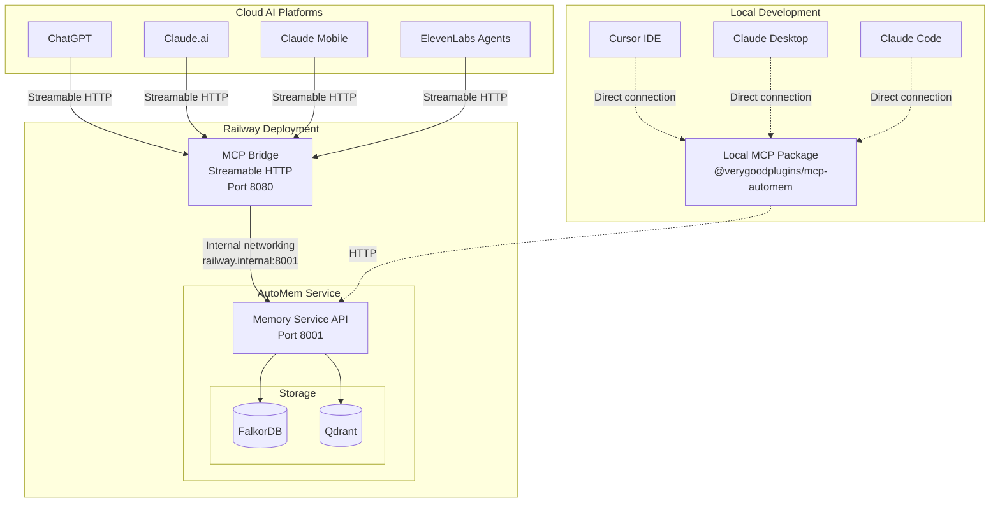
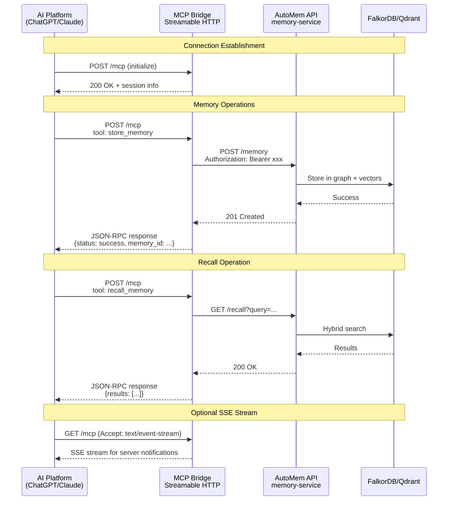

# Remote MCP

The Remote MCP server exposes AutoMem over HTTPS, enabling cloud-based AI platforms to access your memories without local installation.

## Transport Options

AutoMem supports two MCP transport protocols:

| Transport                | Protocol Version | Status         | Endpoint   |
| ------------------------ | ---------------- | -------------- | ---------- |
| **Streamable HTTP**      | 2025-03-26       | ✅ Recommended | `/mcp`     |
| SSE (Server-Sent Events) | 2024-11-05       | ⚠️ Deprecated  | `/mcp/sse` |

**Streamable HTTP** is the newer, recommended transport. It uses a single endpoint, supports session resumability, and works better with proxies and load balancers.

**SSE** is still supported for backward compatibility with older clients.

## Why Use the MCP Bridge?

**Use Case: Cloud AI Platforms**

Most AI platforms (ChatGPT, Claude.ai, ElevenLabs) run in the cloud and can't connect to local MCP servers. The MCP bridge solves this by:

1. Running alongside your AutoMem API on Railway
2. Exposing MCP tools over HTTPS (Streamable HTTP or SSE)
3. Allowing cloud platforms to store and recall memories



**When to Deploy It:**

| Platform              | Needs MCP Bridge? | Notes                           |
| --------------------- | ----------------- | ------------------------------- |
| **ChatGPT**           | ✅ Yes            | Web/mobile, uses MCP connectors |
| **Claude.ai**         | ✅ Yes            | Web interface MCP support       |
| **Claude Mobile**     | ✅ Yes            | iOS/Android app                 |
| **ElevenLabs Agents** | ✅ Yes            | Voice AI with tool calling      |
| **Cursor IDE**        | ❌ No             | Use local `mcp-automem` package |
| **Claude Desktop**    | ❌ No             | Use local `mcp-automem` package |
| **Claude Code**       | ❌ No             | Use local `mcp-automem` package |

**If you only use Cursor, Claude Desktop, or Claude Code**, you don't need the MCP bridge—just install the local MCP package:

```bash
npx @verygoodplugins/mcp-automem cursor  # or 'claude' or 'claude-code'
```

---

## Deploy MCP Bridge on Railway

### Already Using the Template?

The AutoMem Railway template **includes mcp-sse-server by default**. After deploying:

1. Go to Railway Dashboard → `mcp-sse-server` service
2. Click Settings → Networking → **Generate Domain**
3. Your MCP URL is: `https://your-mcp-bridge.up.railway.app/mcp` (Streamable HTTP)
   - Legacy SSE: `https://your-mcp-bridge.up.railway.app/mcp/sse`

Skip to [Client Setup](#client-setup) below.

### Adding MCP Bridge to an Existing Deployment

If you deployed before the MCP bridge was included, add it manually:

1. **Create New Service**

   - In your Railway project, click `+ New Service`
   - Select `GitHub Repo` → `verygoodplugins/automem`

2. **Configure Root Directory**

   - Settings → **Root Directory**: `mcp-sse-server`
   - Railway will auto-detect the Dockerfile

3. **Set Environment Variables**

   ```bash
   PORT=8080
   AUTOMEM_API_URL=http://memory-service.railway.internal:8001
   AUTOMEM_API_TOKEN=<copy from memory-service>
   ```

   > **Important**: Replace `memory-service` with your actual service name if different. Check with: `railway variables --service <your-api-service> | grep RAILWAY_PRIVATE_DOMAIN`

4. **Configure Health Check**

   - Path: `/health`
   - Timeout: 100s

5. **Generate Public Domain**
   - Settings → Networking → Generate Domain
   - Save your URL: `https://your-mcp-bridge.up.railway.app`

---

## Supported Tools

The MCP bridge exposes these MCP tools:

| Tool                    | Description                                 |
| ----------------------- | ------------------------------------------- |
| `store_memory`          | Store a new memory with tags and importance |
| `recall_memory`         | Semantic search across memories             |
| `associate_memories`    | Create relationships between memories       |
| `update_memory`         | Modify existing memory content or metadata  |
| `delete_memory`         | Remove a memory                             |
| `check_database_health` | Verify FalkorDB/Qdrant connectivity         |

## Recall Ordering

`recall_memory` defaults to relevance ranking (`sort: "score"`). For chronological recaps (e.g. “what happened since X”), set:

- `sort: "time_desc"` / `sort: "time_asc"` to order within a time window
- `sort: "updated_desc"` / `sort: "updated_asc"` for the same ordering, named explicitly for updates

Example:

```json
{ "time_query": "last 7 days", "sort": "time_desc" }
```

---

## Client Setup

### Endpoints

| Transport                     | Endpoint                            | Purpose                                              |
| ----------------------------- | ----------------------------------- | ---------------------------------------------------- |
| Streamable HTTP (Recommended) | `POST /mcp`                         | Initialize session & send JSON-RPC                   |
| Streamable HTTP (Recommended) | `GET /mcp`                          | Optional SSE stream when `Accept: text/event-stream` |
| SSE (Deprecated)              | `GET /mcp/sse`                      | SSE stream (server → client)                         |
| SSE (Deprecated)              | `POST /mcp/messages?sessionId=<id>` | Client → server JSON-RPC                             |
| Shared                        | `GET /health`                       | Health probe                                         |



### Authentication

**Header-based** (preferred when supported):

```text
Authorization: Bearer <AUTOMEM_API_TOKEN>
```

**URL-based** (for platforms that only support OAuth):

```url
https://your-mcp-bridge.up.railway.app/mcp/sse?api_token=<AUTOMEM_API_TOKEN>
```

> Note: `?api_key=` also works as an alias

---

### ChatGPT Setup

ChatGPT supports MCP connectors. Use Streamable HTTP if supported, otherwise fall back to SSE:

1. **Enable Developer Mode**

   - Settings → Connectors → Advanced → Enable Developer Mode

2. **Add MCP Server**

   - Click `+ Add Server`
   - **Server URL** (try Streamable HTTP first):
     ```url
     https://your-mcp-bridge.up.railway.app/mcp?api_token=YOUR_TOKEN
     ```
   - **Fallback** (if Streamable HTTP not supported):
     ```url
     https://your-mcp-bridge.up.railway.app/mcp/sse?api_token=YOUR_TOKEN
     ```

3. **Test It**
   - Ask ChatGPT: "Store a memory: I prefer dark mode in all applications"
   - Then: "What are my preferences?"

---

### Claude.ai Setup (Web)

1. Go to Settings → MCP Servers (or similar)
2. **Server URL** (Streamable HTTP):
   ```url
   https://your-mcp-bridge.up.railway.app/mcp?api_token=YOUR_TOKEN
   ```
   Or SSE (if needed):
   ```url
   https://your-mcp-bridge.up.railway.app/mcp/sse?api_token=YOUR_TOKEN
   ```

---

### Claude Mobile Setup (iOS/Android)

1. Open Settings → MCP Servers
2. **Server URL**:
   ```url
   https://your-mcp-bridge.up.railway.app/mcp?api_token=YOUR_TOKEN
   ```

---

### ElevenLabs Agents Setup

ElevenLabs supports custom headers, giving you two options:

**Option 1: Custom Header (Recommended)**

- **Server URL**: `https://your-mcp-bridge.up.railway.app/mcp/sse`
- **Custom Header**:
  - Name: `Authorization`
  - Value: `Bearer YOUR_TOKEN`

**Option 2: URL Parameter**

- **Server URL**: `https://your-mcp-bridge.up.railway.app/mcp/sse?api_token=YOUR_TOKEN`

**Using with Voice Agents:**
ElevenLabs agents can use AutoMem to:

- Remember user preferences across conversations
- Recall context from previous sessions
- Store important decisions and facts

Example agent prompt:

```text
You have access to a persistent memory system. Use store_memory to save
important user preferences, decisions, and facts. Use recall_memory to
retrieve relevant context before answering questions.
```

---

## Troubleshooting

### "fetch failed" or Connection Refused

1. **Check memory-service has `PORT=8001`**

   - Most common cause. Without it, Flask defaults to port 5000.
   - Fix: Add `PORT=8001` to memory-service environment variables.

2. **Verify AUTOMEM_API_URL**

   - Should match your memory service's internal domain:
     ```bash
     AUTOMEM_API_URL=http://memory-service.railway.internal:8001
     ```
   - Check actual domain: `railway variables --service memory-service | grep RAILWAY_PRIVATE_DOMAIN`

3. **Check SSE service logs**

   ```bash
   railway logs --service automem-mcp-sse
   ```

4. **Fallback: Use public URL**
   - If internal networking fails, use the public URL (slower but works):
     ```bash
     AUTOMEM_API_URL=https://your-memory-service.up.railway.app
     ```

### Connection Drops

**Streamable HTTP (recommended):**

- Supports `Last-Event-ID` header for resuming streams
- If connection drops, client can resume from last received event
- Session persists on server until explicitly terminated

**SSE (deprecated):**

- Keepalive heartbeats are sent every 20 seconds
- Some proxies/firewalls may still timeout; check platform-specific limits
- ElevenLabs has a 30-second idle timeout; ensure heartbeats are reaching client

### Authentication Errors

- **401 Unauthorized**: Check token matches `AUTOMEM_API_TOKEN` in memory-service
- **URL tokens in logs**: Normal for URL-based auth; use header auth if security is critical

---

## Advanced: Alexa Integration

The MCP bridge also includes an Alexa skill endpoint:

**Endpoint**: `POST /alexa`

**Supported Intents**:

- `RememberIntent`: "Alexa, tell AutoMem to remember {note}"
- `RecallIntent`: "Alexa, ask AutoMem what I said about {query}"

**Setup**:

1. Create Alexa Custom Skill in developer console
2. Point HTTPS endpoint to: `https://your-mcp-bridge.up.railway.app/alexa`
3. Configure intents with sample utterances

See `mcp-sse-server/README.md` for full Alexa configuration.

---

## Security Notes

- **URL tokens appear in logs**: If using `?api_token=`, be aware tokens may be logged by proxies
- **Internal networking**: Railway private domains are only accessible within your project
- **Rate limiting**: Consider adding a reverse proxy with rate limiting for production
- **Token rotation**: Rotate `AUTOMEM_API_TOKEN` periodically via Railway dashboard
