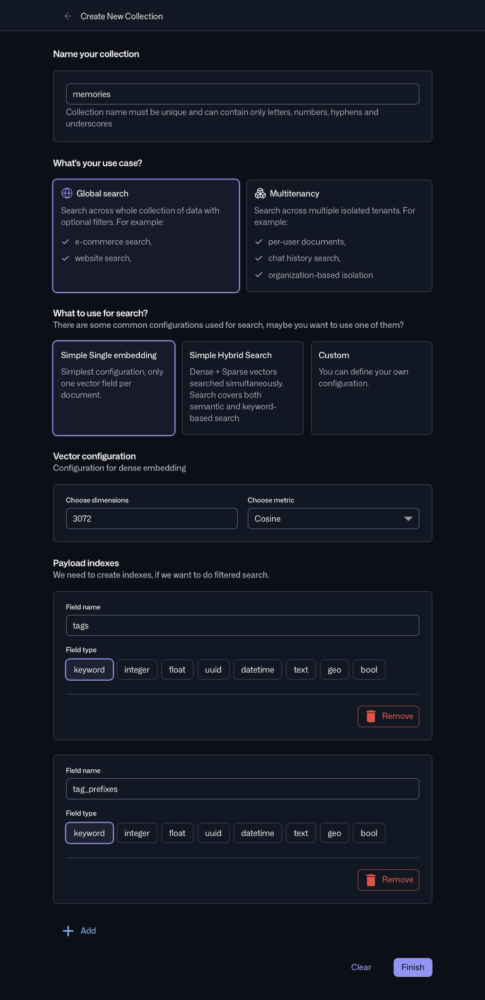

# Qdrant Cloud Setup Guide

Step-by-step guide to setting up Qdrant Cloud for AutoMem's vector storage and semantic search.

## Why Qdrant?

Qdrant stores vector embeddings of your memories, enabling:
- **Semantic search**: Find memories by meaning, not just keywords
- **Similarity matching**: Discover related memories automatically
- **Fast retrieval**: Sub-millisecond search across thousands of memories

**Without Qdrant**: AutoMem uses placeholder embeddings (hash-based). This works for testing but provides no semantic search capability.

---

## Quick Start

### Step 1: Create a Qdrant Cloud Account

1. Go to [cloud.qdrant.io](https://cloud.qdrant.io)
2. Sign up with GitHub, Google, or email
3. Verify your email if required

### Step 2: Create a Cluster

1. Click **"Create Cluster"** (or "Free Cluster" for the free tier)
2. Choose a region close to your Railway deployment
3. **Free tier**: 1GB storage, perfect for getting started
4. Wait for provisioning (~30 seconds)

### Step 3: Create a Collection

1. Click on your cluster to open the dashboard
2. Click **"Create Collection"**
3. Configure as follows:

#### Collection Name
```
memories
```
Use `memories` (default) or a custom name like `memories-projectname`.

> **Note**: If you use a custom name, set `QDRANT_COLLECTION` in AutoMem to match.

#### Use Case
Select: **Global search**

AutoMem searches across all memories with optional tag filters. It's not multi-tenant.

#### Search Configuration
Select: **Simple Single embedding**

AutoMem uses dense vectors (OpenAI embeddings) for semantic search. Keyword matching is handled separately by FalkorDB, so sparse vectors are not needed.

#### Vector Configuration

| Setting | Value | Notes |
|---------|-------|-------|
| **Dense vector name** | Leave as default or use `memories` | Field name for embeddings |
| **Dimensions** | `3072` | For `text-embedding-3-large` (default) |
| **Metric** | `Cosine` | Best for text embeddings |

<a href="img/qdrant-configuration.jpg" target="_blank"></a>

*Click image to view full size*

> **Using a smaller model?** If you set `EMBEDDING_MODEL=text-embedding-3-small`, use `768` dimensions instead and set `VECTOR_SIZE=768` in AutoMem.

#### Payload Indexes (Recommended)

After vector configuration, you'll see a **Payload indexes** section. These speed up filtered searches.

Click **+ Add** and create these indexes:

| Field name | Field type |
|------------|------------|
| `tags` | **keyword** |
| `tag_prefixes` | **keyword** |

Without indexes, Qdrant does full-scan filtering which slows down as your collection grows. With indexes, tag filtering stays fast even with 100k+ memories.

> **Note**: Indexes are optional for small collections (<1000 memories) but recommended for production use.

4. Click **"Finish"**

### Step 4: Get Your API Credentials

1. In your cluster dashboard, click **"API Keys"** or **"Data Access"**
2. Copy your:
   - **Cluster URL**: `https://xxxxx-xxxxx.aws.cloud.qdrant.io`
   - **API Key**: `xxxxxxxxxxxxxxxxxxxxxx`

### Step 5: Configure AutoMem

Add these to your AutoMem environment variables:

```bash
QDRANT_URL="https://xxxxx-xxxxx.aws.cloud.qdrant.io"
QDRANT_API_KEY="your-api-key-here"
QDRANT_COLLECTION="memories"  # Only if using custom name
```

**Railway**: Add these in `AutoMem` → Variables, then redeploy.

**Local**: Add to your `.env` file.

---

## Verify Connection

After configuring, check the health endpoint:

```bash
curl https://your-automem.up.railway.app/health
```

You should see:
```json
{
  "status": "healthy",
  "falkordb": "connected",
  "qdrant": "connected",
  ...
}
```

If `qdrant` shows `"disconnected"` or `"not configured"`:
- Verify `QDRANT_URL` includes `https://`
- Check API key is correct
- Ensure collection exists

---

## Configuration Options

### Embedding Models & Dimensions

| Model | Dimensions | Cost | Quality |
|-------|------------|------|---------|
| `text-embedding-3-large` | 3072 | Higher | Best semantic precision |
| `text-embedding-3-small` | 768 | Lower | Good for most use cases |

**To switch models**:
1. Set `EMBEDDING_MODEL` to your choice
2. Set `VECTOR_SIZE` to match (3072 or 768)
3. Create a new Qdrant collection with matching dimensions
4. Redeploy AutoMem

> ⚠️ **Warning**: Changing embedding models requires re-embedding all existing memories. See [MIGRATIONS.md](MIGRATIONS.md) for the reembed script.

### Custom Collection Names

If you're running multiple AutoMem instances on the same Qdrant cluster:

```bash
QDRANT_COLLECTION="memories-production"
QDRANT_COLLECTION="memories-staging"
QDRANT_COLLECTION="memories-luka"
```

Each collection is isolated—memories in one won't appear in another.

---

## Free Tier Limits

Qdrant Cloud free tier includes:
- **1GB storage** (~50,000-100,000 memories depending on content)
- **Unlimited API calls**
- **No time limit**

For most personal and small team use cases, the free tier is plenty.

### Upgrading

If you exceed 1GB:
1. Go to Qdrant Cloud dashboard
2. Click "Upgrade" on your cluster
3. Choose a paid plan ($25/month for 10GB)

---

## Troubleshooting

### "qdrant: disconnected" in health check

1. **Check URL format**: Must include `https://`
   ```bash
   # ✅ Correct
   QDRANT_URL="https://abc-123.aws.cloud.qdrant.io"

   # ❌ Wrong
   QDRANT_URL="abc-123.aws.cloud.qdrant.io"
   ```

2. **Verify API key**: Copy fresh from Qdrant dashboard

3. **Check collection exists**: Create it if missing

### "Vector dimension mismatch"

AutoMem expects dimensions to match `VECTOR_SIZE`:
- `text-embedding-3-large` → `VECTOR_SIZE=3072`
- `text-embedding-3-small` → `VECTOR_SIZE=768`

If you created the collection with wrong dimensions:
1. Delete the collection in Qdrant dashboard
2. Recreate with correct dimensions
3. Re-store your memories (or run reembed script)

### Memories not appearing in semantic search

1. **Check `OPENAI_API_KEY`**: Required for generating embeddings
2. **Verify embeddings exist**: Check `/health` shows `qdrant: connected`
3. **Wait for enrichment**: New memories are embedded async (few seconds)

---

## Security Notes

- **API keys are secret**: Never commit to git or share publicly
- **Use Railway variables**: Reference via `${{secret()}}` for auto-generation
- **Rotate periodically**: Generate new API keys in Qdrant dashboard monthly

---

## Next Steps

- [Railway Deployment Guide](RAILWAY_DEPLOYMENT.md) — Full deployment walkthrough
- [Environment Variables](ENVIRONMENT_VARIABLES.md) — All configuration options
- [Testing Guide](TESTING.md) — Verify your setup

---

**Questions?** Open an issue: https://github.com/verygoodplugins/automem/issues
