# Testing Guide

This document describes the testing setup for AutoMem and how to run tests against different environments.

## Test Suite Overview

AutoMem has a comprehensive test suite covering:
- API endpoints
- Core functionality
- Consolidation engine
- Enrichment pipeline
- Integration tests

## Quick Commands

```bash
# Unit tests only (fast, no services required)
make test

# Integration tests (local Docker)
make test-integration

# Integration tests (live Railway server)
make test-live
```

## Test Types

```mermaid
flowchart TD
    Start{What are you<br/>testing?}

    Start -->|Code changes| CodeCheck{Changed<br/>API/DB logic?}
    Start -->|Pre-commit| PreCommit[Run: make test<br/>✅ Unit tests only<br/>⚡ Fast 10s]
    Start -->|Before deploy| PreDeploy{Have Railway<br/>deployed?}
    Start -->|Benchmarking| Benchmark[Run: make test-locomo<br/>📊 LoCoMo benchmark<br/>⏱️ 15-25 min]

    CodeCheck -->|No just refactor| PreCommit
    CodeCheck -->|Yes API/DB changes| Integration{Need real<br/>services?}

    Integration -->|Yes| Docker{Have Docker<br/>running?}
    Integration -->|No mock is fine| PreCommit

    Docker -->|Yes| LocalIntegration[Run: make test-integration<br/>🐳 Local Docker stack<br/>⏱️ 60s]
    Docker -->|No| LiveCheck{Have Railway<br/>access?}

    PreDeploy -->|Yes| LiveIntegration[Run: make test-live<br/>☁️ Test against Railway<br/>⏱️ 90s]
    PreDeploy -->|No| LocalIntegration

    LiveCheck -->|Yes| LiveIntegration
    LiveCheck -->|No| SetupDocker[Set up Docker first<br/>docker-compose up]

    SetupDocker --> LocalIntegration

    LocalIntegration --> Success{Tests pass?}
    LiveIntegration --> Success
    PreCommit --> Success
    Benchmark --> BenchSuccess{Score acceptable?}

    Success -->|Yes| Commit[✅ Safe to commit/deploy]
    Success -->|No| Debug[🔍 Debug failures<br/>Check logs]

    BenchSuccess -->|Yes| Commit
    BenchSuccess -->|No| Optimize[🔧 Optimize recall logic]
```



### 1. Unit Tests
**Command**: `make test`

- Fast, isolated tests using mock/stub implementations
- No external services required
- Tests API logic, validation, edge cases
- Safe to run anytime

### 2. Integration Tests (Local)
**Command**: `make test-integration`

- Tests against real Docker services (FalkorDB + Qdrant + API)
- Automatically starts services with test credentials
- Creates test memories tagged with `["test", "integration"]`
- Cleans up all test data after completion
- Requires: Docker, Docker Compose

**What it does:**
1. Starts Docker services with `AUTOMEM_API_TOKEN=test-token`
2. Waits for services to be ready (5s)
3. Runs full integration test suite
4. Tests real database operations, embeddings, associations

### 3. Live Server Tests (Railway)
**Command**: `make test-live`

- Tests against the production Railway deployment
- Verifies local and live environments have matching behavior
- Prompts for confirmation before running (safety measure)
- Automatically fetches Railway credentials
- Requires: Railway CLI, linked project (`railway link`)

**Safety features:**
- Interactive confirmation required
- Only creates/modifies test memories with unique UUIDs
- All test data is cleaned up immediately
- Read-only operations for health checks and recalls

## Test Scripts

### Interactive Live Testing
```bash
./test-live-server.sh
```
Prompts for confirmation before running against production.

### Automated Live Testing
```bash
./test-live-server.sh --non-interactive
```
Non-interactive flag for CI/automation. The legacy `test-live-server-auto.sh` wraps this flag for backward compatibility.

### Manual Integration Testing
```bash
./run-integration-tests.sh
```
Runs integration tests with proper environment setup.

## Environment Variables

### Required for Integration Tests
- `AUTOMEM_RUN_INTEGRATION_TESTS=1` - enables integration tests
- `AUTOMEM_TEST_API_TOKEN` - API authentication token
- `AUTOMEM_TEST_ADMIN_TOKEN` - admin authentication token (optional for some tests)

### Optional Configuration
- `AUTOMEM_TEST_BASE_URL` - override API endpoint (default: `http://localhost:8001`)
- `AUTOMEM_ALLOW_LIVE=1` - required to test against non-localhost URLs
- `AUTOMEM_START_DOCKER=1` - auto-start Docker services
- `AUTOMEM_STOP_DOCKER=1` - auto-stop Docker after tests (default)

## Test Results

All tests are designed to pass cleanly with no unexpected warnings (filtered via `pytest.ini`). Use `make test`, `make test-integration`, or `make test-live` and rely on the `pytest` summary for the current counts.

## Comparing Local vs Live

To verify local Docker environment matches production:

```bash
# Run tests locally
make test-integration

# Run same tests against live
make test-live
```

Both should produce identical results, confirming:
- API responses match
- Authentication works correctly
- Database operations behave the same
- Embeddings are generated consistently

## Troubleshooting

### "API not available" error
The integration tests wait up to 10 seconds for the API to be ready. If services take longer:
- Check `docker compose ps` to see service status
- Check `docker compose logs flask-api` for startup errors
- Manually verify health: `curl http://localhost:8001/health`

### "Unauthorized" errors (401)
Ensure environment variables match:
- Local: `AUTOMEM_API_TOKEN=test-token`
- Docker: Set via `docker-compose.yml` environment section
- Railway: Check with `railway variables`

### Railway CLI issues
```bash
# Install Railway CLI
npm install -g @railway/cli

# Link to project
railway link

# Verify connection
railway status
```

## CI/CD Integration

For automated testing in CI:

```bash
# Unit tests (always safe)
make test

# Integration tests (if Docker available)
make test-integration

# Live tests (if Railway credentials available)
./test-live-server.sh --non-interactive
```

## LoCoMo Benchmark

AutoMem can be evaluated against the **LoCoMo benchmark** (ACL 2024), which tests long-term conversational memory across 10 conversations and 1,986 questions.

### What is LoCoMo?

LoCoMo evaluates AI systems' ability to remember and reason across very long conversations (300+ turns). It measures performance across 5 categories:

1. **Single-hop Recall** (Category 1) - Simple fact retrieval: "What is Caroline's identity?"
2. **Temporal Understanding** (Category 2) - Time-based queries: "When did Caroline move to Sweden?"
3. **Multi-hop Reasoning** (Category 3) - Connecting multiple memories: "What fields would Caroline pursue in education?"
4. **Open Domain** (Category 4) - General knowledge questions
5. **Complex Reasoning** (Category 5) - Advanced inference tasks

**Comparison**: CORE achieved 88.24% (June 2025). AutoMem achieved 90.53%.

### Running the Benchmark

```bash
# Quick commands
make test-locomo              # Run locally against Docker
make test-locomo-live         # Run against Railway deployment

# With options
./test-locomo-benchmark.sh --recall-limit 20 --output results.json
./test-locomo-benchmark.sh --live --no-cleanup
```

### What the Benchmark Tests

1. **Memory Storage**: Loads ~10,000 dialog turns from 10 conversations
2. **Hybrid Recall**: Tests semantic + keyword + tag-based retrieval
3. **Graph Relationships**: Evaluates multi-hop reasoning via relationship traversal
4. **Temporal Queries**: Tests time-based memory filtering
5. **Answer Accuracy**: Checks if recalled memories contain correct answers

### Performance Expectations

The benchmark takes approximately:
- **Local Docker**: 10–20 minutes
- **Railway**: 15–25 minutes (network latency)

Memory usage:
- **FalkorDB**: ~6,000–10,000 nodes
- **Qdrant**: ~6,000–10,000 vectors (3072 dimensions by default, or 768 with small model)

### Interpreting Results

Example benchmark output:
```text
📊 FINAL RESULTS
🎯 Overall Accuracy: 90.53% (1798/1986)
⏱️ Total Time: 1665s
💾 Total Memories Stored: 5882

📈 Category Breakdown:
  Single-hop Recall        : 79.79% (225/282)
  Temporal Understanding   : 85.05% (273/321)
  Multi-hop Reasoning      : 50.00% ( 48/ 96)
  Open Domain              : 95.84% (806/841)
  Complex Reasoning        : 100.00% (446/446)

📊 Comparison:
  CORE: 88.24%
  AutoMem: 90.53%
```

All benchmark reports live in `tests/benchmarks/`.
```

### AutoMem's Advantages

AutoMem is expected to perform well due to:

1. **Richer Graph**: 11 relationship types vs CORE's basic temporal links
   - `RELATES_TO`, `LEADS_TO`, `OCCURRED_BEFORE`
   - `PREFERS_OVER`, `EXEMPLIFIES`, `CONTRADICTS`
   - `REINFORCES`, `INVALIDATED_BY`, `EVOLVED_INTO`
   - `DERIVED_FROM`, `PART_OF`

2. **Hybrid Search**: Vector + keyword + tags + importance + time
   - Better than pure semantic search
   - More reliable than vector-only systems

3. **Background Intelligence**:
   - Entity extraction for structured queries
   - Pattern detection for common themes
   - Consolidation for improved relevance

4. **Dual Storage**: FalkorDB + Qdrant provides redundancy and complementary retrieval

### Benchmark Setup

The LoCoMo benchmark is automatically cloned during first run:
```bash
tests/benchmarks/locomo/
├── data/
│   └── locomo10.json          # 10 conversations, 1,986 questions
├── task_eval/                 # Evaluation utilities
└── README.MD                  # Benchmark documentation
```

### Troubleshooting

**"LoCoMo dataset not found"**
```bash
cd tests/benchmarks
git clone https://github.com/snap-research/locomo.git
```

**Low accuracy scores**
- Check if enrichment pipeline is enabled
- Verify OpenAI API key is set (for embeddings)
- Increase `--recall-limit` (default: 10)
- Review individual question results in output JSON

**Timeout errors**
- Reduce batch size in config
- Increase pause between batches
- Use Railway for better performance

### Research Citation

```bibtex
@article{maharana2024evaluating,
  title={Evaluating very long-term conversational memory of llm agents},
  author={Maharana, Adyasha and Lee, Dong-Ho and Tulyakov, Sergey and Bansal, Mohit and Barbieri, Francesco and Fang, Yuwei},
  journal={arXiv preprint arXiv:2402.17753},
  year={2024}
}
```

---

## Best Practices

1. **Always run unit tests** before committing
2. **Run integration tests** when changing API logic or database operations
3. **Run live tests** before deploying to verify no regressions
4. **Check test coverage** with `pytest --cov` (requires pytest-cov)
5. **Review test output** - integration tests show actual API responses
6. **Run LoCoMo benchmark** before major releases to validate memory performance
